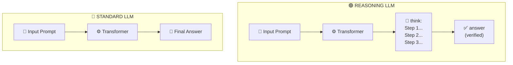
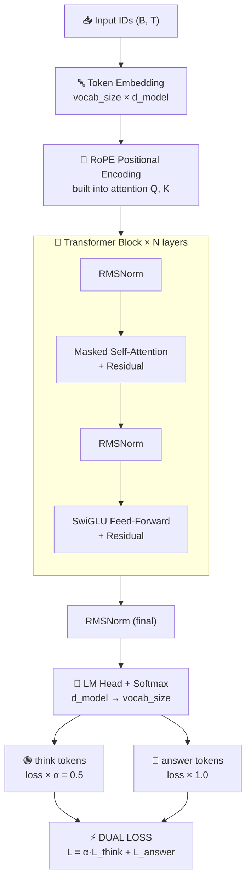
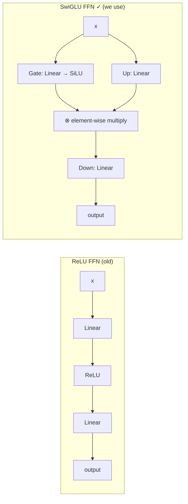
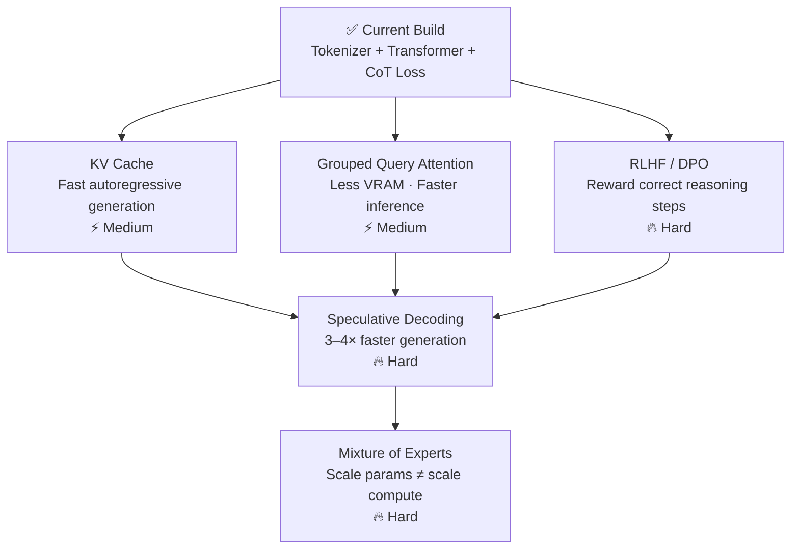

> **No APIs. No wrappers. No shortcuts.** Just pure Python, NumPy, and PyTorch — building a transformer that actually *thinks* before it answers.

## Quick Stats

| Metric | Value |
|--------|-------|
| 📄 Core Python files | 6 |
| 💻 Total lines of code | ~600 |
| 🔌 External AI APIs used | **0** |
| 🧠 Architecture | Decoder-only Transformer |
| ⚡ Special feature | Dual-loss CoT training |

## 1. What Makes a Model a Reasoning Model?

A regular language model predicts the next token given a context window — nothing more. A **reasoning model** does the same thing, but its training data and inference strategy are specifically designed to produce *chains of intermediate steps* before emitting a final answer.

Think of it as the difference between blurting out `"5"` versus writing out the long-division working that arrives at `"5"`.

Concretely, three things separate a reasoning model from a plain LLM:

- **Scratchpad tokens** — special tokens like `<think>` that the model uses as working memory
- **Chain-of-thought (CoT) training data** — the corpus includes step-by-step solutions, not just final answers
- **Verification loss** — the model is rewarded not only for the right answer, but for intermediate steps that are correct

### 📊 Standard LLM vs Reasoning LLM



> 💡 **Key insight:** The model doesn't become smarter by magic. It becomes smarter because it learned — from training data — that writing out intermediate steps leads to more reliable final answers.

## 2. The Architecture at a Glance

Our reasoning LLM is a **decoder-only transformer** — the same family as GPT, LLaMA, and DeepSeek. We add one twist: a small vocabulary of special reasoning tokens and a modified loss function that weights scratchpad steps alongside final answers.

### 📊 Full Model Architecture



## 3. Step 1 — Build a Tokenizer

A tokenizer converts raw text into integer IDs the model can process. We implement a simple **Byte-Pair Encoding (BPE)** tokenizer that also registers our special reasoning tokens.

### 📊 Special Token Registry

<svg viewBox="0 0 700 280" xmlns="http://www.w3.org/2000/svg" width="100%">
  <rect width="700" height="280" rx="12" fill="#0b0f1a"/>

  <text x="350" y="34" fill="#38bdf8" font-size="13" font-weight="700"
        text-anchor="middle" font-family="monospace" letter-spacing="2">SPECIAL TOKEN REGISTRY</text>

  <rect x="24" y="46" width="652" height="30" rx="4" fill="#1a2235"/>
  <text x="80"  y="66" fill="#818cf8" font-size="12" font-weight="700" font-family="monospace">TOKEN</text>
  <text x="240" y="66" fill="#818cf8" font-size="12" font-weight="700" font-family="monospace">ID</text>
  <text x="320" y="66" fill="#818cf8" font-size="12" font-weight="700" font-family="monospace">PURPOSE</text>

  <rect x="24" y="76" width="652" height="24" rx="0" fill="#111827"/>
  <text x="80"  y="92" fill="#94a3b8" font-size="12" font-family="monospace">&lt;pad&gt;</text>
  <text x="240" y="92" fill="#e2e8f0" font-size="12" font-family="monospace">0</text>
  <text x="320" y="92" fill="#64748b" font-size="12" font-family="monospace">Padding — ignored in loss</text>

  <rect x="24" y="100" width="652" height="24" rx="0" fill="#1a2235"/>
  <text x="80"  y="116" fill="#94a3b8" font-size="12" font-family="monospace">&lt;unk&gt;</text>
  <text x="240" y="116" fill="#e2e8f0" font-size="12" font-family="monospace">1</text>
  <text x="320" y="116" fill="#64748b" font-size="12" font-family="monospace">Unknown token fallback</text>

  <rect x="24" y="124" width="652" height="24" rx="0" fill="#111827"/>
  <text x="80"  y="140" fill="#94a3b8" font-size="12" font-family="monospace">&lt;bos&gt;</text>
  <text x="240" y="140" fill="#e2e8f0" font-size="12" font-family="monospace">2</text>
  <text x="320" y="140" fill="#64748b" font-size="12" font-family="monospace">Begin of sequence</text>

  <rect x="24" y="148" width="652" height="24" rx="0" fill="#1a2235"/>
  <text x="80"  y="164" fill="#94a3b8" font-size="12" font-family="monospace">&lt;eos&gt;</text>
  <text x="240" y="164" fill="#e2e8f0" font-size="12" font-family="monospace">3</text>
  <text x="320" y="164" fill="#64748b" font-size="12" font-family="monospace">End of sequence</text>

  <rect x="24" y="172" width="652" height="24" rx="0" fill="rgba(52,211,153,0.10)"/>
  <text x="80"  y="188" fill="#34d399" font-size="12" font-family="monospace" font-weight="700">&lt;think&gt;</text>
  <text x="240" y="188" fill="#34d399" font-size="12" font-family="monospace" font-weight="700">4</text>
  <text x="320" y="188" fill="#34d399" font-size="12" font-family="monospace">← Begin scratchpad reasoning</text>

  <rect x="24" y="196" width="652" height="24" rx="0" fill="rgba(52,211,153,0.06)"/>
  <text x="80"  y="212" fill="#34d399" font-size="12" font-family="monospace" font-weight="700">&lt;/think&gt;</text>
  <text x="240" y="212" fill="#34d399" font-size="12" font-family="monospace" font-weight="700">5</text>
  <text x="320" y="212" fill="#34d399" font-size="12" font-family="monospace">← End scratchpad reasoning</text>

  <rect x="24" y="220" width="652" height="24" rx="0" fill="rgba(129,140,248,0.10)"/>
  <text x="80"  y="236" fill="#818cf8" font-size="12" font-family="monospace" font-weight="700">&lt;answer&gt;</text>
  <text x="240" y="236" fill="#818cf8" font-size="12" font-family="monospace" font-weight="700">6</text>
  <text x="320" y="236" fill="#818cf8" font-size="12" font-family="monospace">← Begin final answer</text>

  <rect x="24" y="244" width="652" height="24" rx="0" fill="rgba(129,140,248,0.06)"/>
  <text x="80"  y="260" fill="#818cf8" font-size="12" font-family="monospace" font-weight="700">&lt;/answer&gt;</text>
  <text x="240" y="260" fill="#818cf8" font-size="12" font-family="monospace" font-weight="700">7</text>
  <text x="320" y="260" fill="#818cf8" font-size="12" font-family="monospace">← End final answer</text>
</svg>

```python
# tokenizer.py
from collections import defaultdict, Counter
import re

SPECIAL_TOKENS = {
    "<pad>":     0,
    "<unk>":     1,
    "<bos>":     2,
    "<eos>":     3,
    "<think>":   4,    # begin scratchpad
    "</think>":  5,    # end scratchpad
    "<answer>":  6,    # begin final answer
    "</answer>": 7,    # end final answer
}

class BPETokenizer:
    def __init__(self, vocab_size: int = 8000):
        self.vocab_size = vocab_size
        self.vocab      = dict(SPECIAL_TOKENS)
        self.inv_vocab  = {v: k for k, v in self.vocab.items()}
        self.merges     = []

    def _get_pairs(self, word_freqs):
        pairs = defaultdict(int)
        for word, freq in word_freqs.items():
            symbols = word.split()
            for i in range(len(symbols) - 1):
                pairs[(symbols[i], symbols[i + 1])] += freq
        return pairs

    def train(self, corpus: str) -> None:
        """Train BPE on a raw text corpus string."""
        words      = re.findall(r'\S+', corpus.lower())
        word_freqs = Counter(' '.join(list(w)) + ' </w>' for w in words)

        next_id = len(self.vocab)
        for word in word_freqs:
            for ch in word.split():
                if ch not in self.vocab:
                    self.vocab[ch]          = next_id
                    self.inv_vocab[next_id] = ch
                    next_id += 1

        while len(self.vocab) < self.vocab_size:
            pairs = self._get_pairs(word_freqs)
            if not pairs:
                break
            best   = max(pairs, key=pairs.get)
            merged = ''.join(best)
            self.merges.append(best)
            self.vocab[merged]      = next_id
            self.inv_vocab[next_id] = merged
            next_id += 1
            pattern    = re.compile(r'(?<!\S)' + re.escape(' '.join(best)) + r'(?!\S)')
            word_freqs = {pattern.sub(merged, w): f for w, f in word_freqs.items()}

    def encode(self, text: str) -> list[int]:
        tokens = [self.vocab.get(t, 1) for t in text.split()]
        return [SPECIAL_TOKENS["<bos>"]] + tokens + [SPECIAL_TOKENS["<eos>"]]

    def decode(self, ids: list[int]) -> str:
        return ' '.join(self.inv_vocab.get(i, '<unk>') for i in ids)
```

> ⚠️ **Note:** The `<think>` and `</think>` tokens are hardcoded at IDs 4–7 so they are always present regardless of training corpus. The model learns to emit them by seeing CoT-formatted training examples.

## 4. Step 2 — Embeddings & Positional Encoding

Embeddings map integer token IDs to dense vectors. We add **Rotary Positional Encoding (RoPE)** — the same technique used in LLaMA and Mistral — directly inside the attention layer.

### 📊 RoPE vs Sinusoidal Positional Encoding

<svg viewBox="0 0 700 180" xmlns="http://www.w3.org/2000/svg" width="100%">
  <rect width="700" height="180" rx="12" fill="#0b0f1a"/>

  <text x="350" y="30" fill="#38bdf8" font-size="13" font-weight="700"
        text-anchor="middle" font-family="monospace" letter-spacing="2">POSITIONAL ENCODING COMPARISON</text>

  <rect x="24" y="42" width="652" height="26" rx="4" fill="#1a2235"/>
  <text x="110" y="60" fill="#818cf8" font-size="11" font-weight="700" font-family="monospace" text-anchor="middle">FEATURE</text>
  <text x="310" y="60" fill="#818cf8" font-size="11" font-weight="700" font-family="monospace" text-anchor="middle">SINUSOIDAL</text>
  <text x="530" y="60" fill="#34d399" font-size="11" font-weight="700" font-family="monospace" text-anchor="middle">RoPE ✓  (we use this)</text>

  <rect x="24"  y="68" width="652" height="22" fill="#111827"/>
  <text x="110" y="83" fill="#94a3b8" font-size="11" font-family="monospace" text-anchor="middle">Extra parameters</text>
  <text x="310" y="83" fill="#e2e8f0" font-size="11" font-family="monospace" text-anchor="middle">None</text>
  <text x="530" y="83" fill="#34d399" font-size="11" font-family="monospace" text-anchor="middle">None</text>

  <rect x="24"  y="90" width="652" height="22" fill="#1a2235"/>
  <text x="110" y="105" fill="#94a3b8" font-size="11" font-family="monospace" text-anchor="middle">Long sequences</text>
  <text x="310" y="105" fill="#f87171" font-size="11" font-family="monospace" text-anchor="middle">Degrades</text>
  <text x="530" y="105" fill="#34d399" font-size="11" font-family="monospace" text-anchor="middle">Extrapolates well</text>

  <rect x="24"  y="112" width="652" height="22" fill="#111827"/>
  <text x="110" y="127" fill="#94a3b8" font-size="11" font-family="monospace" text-anchor="middle">Where applied</text>
  <text x="310" y="127" fill="#e2e8f0" font-size="11" font-family="monospace" text-anchor="middle">After embedding layer</text>
  <text x="530" y="127" fill="#34d399" font-size="11" font-family="monospace" text-anchor="middle">Inside attention Q, K</text>

  <rect x="24"  y="134" width="652" height="22" fill="#1a2235"/>
  <text x="110" y="149" fill="#94a3b8" font-size="11" font-family="monospace" text-anchor="middle">Relative position</text>
  <text x="310" y="149" fill="#e2e8f0" font-size="11" font-family="monospace" text-anchor="middle">Implicit only</text>
  <text x="530" y="149" fill="#34d399" font-size="11" font-family="monospace" text-anchor="middle">Explicit</text>

  <rect x="24"  y="156" width="652" height="22" fill="#111827"/>
  <text x="110" y="171" fill="#94a3b8" font-size="11" font-family="monospace" text-anchor="middle">Used by</text>
  <text x="310" y="171" fill="#e2e8f0" font-size="11" font-family="monospace" text-anchor="middle">GPT-2, BERT</text>
  <text x="530" y="171" fill="#34d399" font-size="11" font-family="monospace" text-anchor="middle">LLaMA, Mistral, Qwen</text>
</svg>

```python
# embeddings.py
import torch, torch.nn as nn, math

class TokenEmbedding(nn.Module):
    def __init__(self, vocab_size: int, d_model: int):
        super().__init__()
        self.embed = nn.Embedding(vocab_size, d_model, padding_idx=0)
        self.scale = math.sqrt(d_model)

    def forward(self, x):   # x: (B, T)
        return self.embed(x) * self.scale


def precompute_rope(d_head: int, max_seq: int, base: int = 10_000):
    """Precompute RoPE frequency matrix as complex numbers."""
    theta = 1.0 / (base ** (torch.arange(0, d_head, 2).float() / d_head))
    pos   = torch.arange(max_seq).float()
    freqs = torch.outer(pos, theta)              # (T, d_head/2)
    return torch.polar(torch.ones_like(freqs), freqs)


def apply_rope(q, k, freqs):
    """Apply rotary encoding to query and key tensors."""
    q_ = torch.view_as_complex(q.float().reshape(*q.shape[:-1], -1, 2))
    k_ = torch.view_as_complex(k.float().reshape(*k.shape[:-1], -1, 2))
    q_rot = torch.view_as_real(q_ * freqs).flatten(3)
    k_rot = torch.view_as_real(k_ * freqs).flatten(3)
    return q_rot.type_as(q), k_rot.type_as(k)
```

## 5. Step 3 — Self-Attention from Scratch

Masked multi-head self-attention is the computational heart of every transformer. Each token attends to all preceding tokens — the causal mask prevents it from seeing the future.

### 📊 Causal Attention Mask & Multi-Head Layout

<svg viewBox="0 0 700 300" xmlns="http://www.w3.org/2000/svg" width="100%">
  <rect width="700" height="300" rx="12" fill="#0b0f1a"/>

  <text x="175" y="28" fill="#38bdf8" font-size="12" font-weight="700"
        text-anchor="middle" font-family="monospace" letter-spacing="1">CAUSAL MASK  (4 tokens)</text>
  <text x="530" y="28" fill="#818cf8" font-size="12" font-weight="700"
        text-anchor="middle" font-family="monospace" letter-spacing="1">MULTI-HEAD ATTENTION</text>

  <text x="86"  y="56" fill="#64748b" font-size="11" text-anchor="middle" font-family="monospace">x1</text>
  <text x="132" y="56" fill="#64748b" font-size="11" text-anchor="middle" font-family="monospace">x2</text>
  <text x="178" y="56" fill="#64748b" font-size="11" text-anchor="middle" font-family="monospace">x3</text>
  <text x="224" y="56" fill="#64748b" font-size="11" text-anchor="middle" font-family="monospace">x4</text>
  <text x="48"  y="82"  fill="#64748b" font-size="11" text-anchor="middle" font-family="monospace">x1</text>
  <text x="48"  y="128" fill="#64748b" font-size="11" text-anchor="middle" font-family="monospace">x2</text>
  <text x="48"  y="174" fill="#64748b" font-size="11" text-anchor="middle" font-family="monospace">x3</text>
  <text x="48"  y="220" fill="#64748b" font-size="11" text-anchor="middle" font-family="monospace">x4</text>

  <rect x="64"  y="62" width="44" height="40" rx="4" fill="rgba(56,189,248,0.65)"/>
  <rect x="110" y="62" width="44" height="40" rx="4" fill="#172033" stroke="#1e2d45" stroke-width="1"/>
  <rect x="156" y="62" width="44" height="40" rx="4" fill="#172033" stroke="#1e2d45" stroke-width="1"/>
  <rect x="202" y="62" width="44" height="40" rx="4" fill="#172033" stroke="#1e2d45" stroke-width="1"/>
  <text x="86"  y="87" fill="#0b0f1a" font-size="11" text-anchor="middle" font-family="monospace" font-weight="700">1.0</text>
  <text x="132" y="87" fill="#475569" font-size="11" text-anchor="middle" font-family="monospace">−∞</text>
  <text x="178" y="87" fill="#475569" font-size="11" text-anchor="middle" font-family="monospace">−∞</text>
  <text x="224" y="87" fill="#475569" font-size="11" text-anchor="middle" font-family="monospace">−∞</text>

  <rect x="64"  y="108" width="44" height="40" rx="4" fill="rgba(56,189,248,0.40)"/>
  <rect x="110" y="108" width="44" height="40" rx="4" fill="rgba(56,189,248,0.65)"/>
  <rect x="156" y="108" width="44" height="40" rx="4" fill="#172033" stroke="#1e2d45" stroke-width="1"/>
  <rect x="202" y="108" width="44" height="40" rx="4" fill="#172033" stroke="#1e2d45" stroke-width="1"/>
  <text x="86"  y="133" fill="#e2e8f0" font-size="11" text-anchor="middle" font-family="monospace">0.6</text>
  <text x="132" y="133" fill="#0b0f1a" font-size="11" text-anchor="middle" font-family="monospace" font-weight="700">1.0</text>
  <text x="178" y="133" fill="#475569" font-size="11" text-anchor="middle" font-family="monospace">−∞</text>
  <text x="224" y="133" fill="#475569" font-size="11" text-anchor="middle" font-family="monospace">−∞</text>

  <rect x="64"  y="154" width="44" height="40" rx="4" fill="rgba(56,189,248,0.28)"/>
  <rect x="110" y="154" width="44" height="40" rx="4" fill="rgba(56,189,248,0.45)"/>
  <rect x="156" y="154" width="44" height="40" rx="4" fill="rgba(56,189,248,0.65)"/>
  <rect x="202" y="154" width="44" height="40" rx="4" fill="#172033" stroke="#1e2d45" stroke-width="1"/>
  <text x="86"  y="179" fill="#e2e8f0" font-size="11" text-anchor="middle" font-family="monospace">0.3</text>
  <text x="132" y="179" fill="#e2e8f0" font-size="11" text-anchor="middle" font-family="monospace">0.5</text>
  <text x="178" y="179" fill="#0b0f1a" font-size="11" text-anchor="middle" font-family="monospace" font-weight="700">1.0</text>
  <text x="224" y="179" fill="#475569" font-size="11" text-anchor="middle" font-family="monospace">−∞</text>

  <rect x="64"  y="200" width="44" height="40" rx="4" fill="rgba(56,189,248,0.20)"/>
  <rect x="110" y="200" width="44" height="40" rx="4" fill="rgba(56,189,248,0.35)"/>
  <rect x="156" y="200" width="44" height="40" rx="4" fill="rgba(56,189,248,0.50)"/>
  <rect x="202" y="200" width="44" height="40" rx="4" fill="rgba(56,189,248,0.65)"/>
  <text x="86"  y="225" fill="#e2e8f0" font-size="11" text-anchor="middle" font-family="monospace">0.2</text>
  <text x="132" y="225" fill="#e2e8f0" font-size="11" text-anchor="middle" font-family="monospace">0.4</text>
  <text x="178" y="225" fill="#e2e8f0" font-size="11" text-anchor="middle" font-family="monospace">0.7</text>
  <text x="224" y="225" fill="#0b0f1a" font-size="11" text-anchor="middle" font-family="monospace" font-weight="700">1.0</text>

  <rect x="64"  y="256" width="16" height="16" rx="3" fill="rgba(56,189,248,0.65)"/>
  <text x="86"  y="268" fill="#94a3b8" font-size="11" font-family="monospace">attend</text>
  <rect x="140" y="256" width="16" height="16" rx="3" fill="#172033" stroke="#1e2d45"/>
  <text x="162" y="268" fill="#94a3b8" font-size="11" font-family="monospace">−∞ masked</text>

  <rect x="310" y="46" width="100" height="38" rx="6" fill="#172033" stroke="#38bdf8" stroke-opacity="0.5"/>
  <text x="360" y="70" fill="#38bdf8" font-size="12" text-anchor="middle" font-family="monospace">Head 1</text>

  <rect x="420" y="46" width="100" height="38" rx="6" fill="#172033" stroke="#818cf8" stroke-opacity="0.5"/>
  <text x="470" y="70" fill="#818cf8" font-size="12" text-anchor="middle" font-family="monospace">Head 2</text>

  <rect x="530" y="46" width="100" height="38" rx="6" fill="#172033" stroke="#34d399" stroke-opacity="0.5"/>
  <text x="580" y="70" fill="#34d399" font-size="12" text-anchor="middle" font-family="monospace">Head H</text>

  <text x="505" y="62" fill="#64748b" font-size="16" text-anchor="middle">…</text>

  <line x1="360" y1="84" x2="360" y2="108" stroke="#38bdf8" stroke-width="1.5" marker-end="url(#da)"/>
  <line x1="470" y1="84" x2="470" y2="108" stroke="#818cf8" stroke-width="1.5" marker-end="url(#da)"/>
  <line x1="580" y1="84" x2="580" y2="108" stroke="#34d399" stroke-width="1.5" marker-end="url(#da)"/>
  <defs>
    <marker id="da" markerWidth="7" markerHeight="7" refX="3" refY="6" orient="auto">
      <path d="M0,0 L6,0 L3,7 z" fill="#38bdf8"/>
    </marker>
  </defs>

  <rect x="310" y="110" width="320" height="36" rx="6" fill="rgba(56,189,248,0.08)" stroke="#38bdf8" stroke-opacity="0.4"/>
  <text x="470" y="133" fill="#e2e8f0" font-size="12" text-anchor="middle" font-family="monospace">Concat(h1, h2, … hH)</text>

  <line x1="470" y1="146" x2="470" y2="168" stroke="#38bdf8" stroke-width="1.5" marker-end="url(#da)"/>

  <rect x="380" y="170" width="180" height="36" rx="6" fill="#172033" stroke="#fb923c" stroke-opacity="0.5"/>
  <text x="470" y="193" fill="#fb923c" font-size="12" text-anchor="middle" font-family="monospace">× W_O  →  output</text>

  <rect x="310" y="222" width="360" height="56" rx="6" fill="#1a2235"/>
  <text x="490" y="244" fill="#94a3b8" font-size="11" text-anchor="middle" font-family="monospace">softmax( Q·Kᵀ / √d_k ) · V</text>
  <text x="490" y="262" fill="#64748b" font-size="10" text-anchor="middle" font-family="monospace">upper-triangle of QKᵀ  =  −∞  (causal mask)</text>
  <text x="490" y="278" fill="#64748b" font-size="10" text-anchor="middle" font-family="monospace">d_head = d_model / n_heads</text>
</svg>

```python
# attention.py
import torch, torch.nn as nn, torch.nn.functional as F
from embeddings import precompute_rope, apply_rope

class CausalSelfAttention(nn.Module):
    def __init__(self, d_model: int, n_heads: int, max_seq: int, dropout=0.1):
        super().__init__()
        assert d_model % n_heads == 0
        self.n_heads = n_heads
        self.d_head  = d_model // n_heads
        self.qkv     = nn.Linear(d_model, 3 * d_model, bias=False)
        self.out     = nn.Linear(d_model, d_model,     bias=False)
        self.drop    = nn.Dropout(dropout)
        freqs = precompute_rope(self.d_head, max_seq)
        self.register_buffer('freqs', freqs)

    def forward(self, x):          # x: (B, T, D)
        B, T, D = x.shape
        qkv     = self.qkv(x).split(D, dim=-1)
        q, k, v = [
            t.view(B, T, self.n_heads, self.d_head).transpose(1, 2)
            for t in qkv
        ]
        q, k = apply_rope(q, k, self.freqs[:T])
        attn = F.scaled_dot_product_attention(
            q, k, v,
            is_causal=True,
            dropout_p=self.drop.p if self.training else 0.0
        )
        attn = attn.transpose(1, 2).contiguous().view(B, T, D)
        return self.out(attn)
```

## 6. Step 4 — The Transformer Block

Each transformer block wraps the attention layer with a feed-forward network and RMS normalisation. We use **SwiGLU** as the activation — the same choice made by LLaMA, Mistral, and Gemma.

### 📊 SwiGLU vs ReLU FFN



```python
# model.py
import torch, torch.nn as nn, torch.nn.functional as F
from attention  import CausalSelfAttention
from embeddings import TokenEmbedding

class RMSNorm(nn.Module):
    def __init__(self, d: int, eps: float = 1e-6):
        super().__init__()
        self.g, self.eps = nn.Parameter(torch.ones(d)), eps

    def forward(self, x):
        return x * x.pow(2).mean(-1, keepdim=True).add(self.eps).rsqrt() * self.g


class SwiGLUFFN(nn.Module):
    def __init__(self, d_model: int, hidden: int):
        super().__init__()
        self.gate = nn.Linear(d_model, hidden, bias=False)
        self.up   = nn.Linear(d_model, hidden, bias=False)
        self.down = nn.Linear(hidden,  d_model, bias=False)

    def forward(self, x):
        return self.down(F.silu(self.gate(x)) * self.up(x))


class TransformerBlock(nn.Module):
    def __init__(self, d_model, n_heads, max_seq, ffn_mult=4, dropout=0.1):
        super().__init__()
        self.attn  = CausalSelfAttention(d_model, n_heads, max_seq, dropout)
        self.ffn   = SwiGLUFFN(d_model, int(d_model * ffn_mult * 2 / 3))
        self.norm1 = RMSNorm(d_model)
        self.norm2 = RMSNorm(d_model)

    def forward(self, x):
        x = x + self.attn(self.norm1(x))   # pre-norm + residual
        x = x + self.ffn(self.norm2(x))
        return x


class ReasoningLLM(nn.Module):
    def __init__(self, vocab_size, d_model=256, n_heads=8,
                 n_layers=6, max_seq=512, dropout=0.1):
        super().__init__()
        self.embed   = TokenEmbedding(vocab_size, d_model)
        self.blocks  = nn.ModuleList([
            TransformerBlock(d_model, n_heads, max_seq, dropout=dropout)
            for _ in range(n_layers)
        ])
        self.norm    = RMSNorm(d_model)
        self.lm_head = nn.Linear(d_model, vocab_size, bias=False)
        # Weight tying — cuts params by 15–30%, zero accuracy cost
        self.lm_head.weight = self.embed.embed.weight

    def forward(self, ids):            # (B, T)
        x = self.embed(ids)
        for block in self.blocks:
            x = block(x)
        return self.lm_head(self.norm(x))  # (B, T, vocab_size)
```

## 7. Step 5 — Chain-of-Thought Training Strategy

This is the **key differentiator**. Every training example is formatted as a problem → scratchpad → answer triple. We compute loss over both spans with separate weights.

### 📊 CoT Training Sequence & Loss Mask

<svg viewBox="0 0 700 240" xmlns="http://www.w3.org/2000/svg" width="100%">
  <rect width="700" height="240" rx="12" fill="#0b0f1a"/>

  <text x="350" y="28" fill="#38bdf8" font-size="13" font-weight="700"
        text-anchor="middle" font-family="monospace" letter-spacing="2">TRAINING SEQUENCE LAYOUT</text>

  <rect x="24"  y="40" width="148" height="52" rx="6" fill="rgba(100,116,139,0.12)" stroke="#475569"/>
  <text x="98"  y="62" fill="#64748b" font-size="11" text-anchor="middle" font-family="monospace" font-weight="700">PROBLEM</text>
  <text x="98"  y="80" fill="#475569" font-size="10" text-anchor="middle" font-family="monospace">loss weight = 0.0</text>

  <rect x="178" y="40" width="264" height="52" rx="6" fill="rgba(52,211,153,0.10)" stroke="#34d399" stroke-opacity="0.6"/>
  <text x="194" y="58" fill="#34d399" font-size="10" font-family="monospace">&lt;think&gt;</text>
  <text x="310" y="62" fill="#34d399" font-size="11" text-anchor="middle" font-family="monospace" font-weight="700">SCRATCHPAD</text>
  <text x="310" y="80" fill="#34d399" font-size="10" text-anchor="middle" font-family="monospace">loss weight = α = 0.5</text>
  <text x="414" y="58" fill="#34d399" font-size="10" font-family="monospace">&lt;/think&gt;</text>

  <rect x="448" y="40" width="228" height="52" rx="6" fill="rgba(129,140,248,0.10)" stroke="#818cf8" stroke-opacity="0.6"/>
  <text x="462" y="58" fill="#818cf8" font-size="10" font-family="monospace">&lt;answer&gt;</text>
  <text x="562" y="62" fill="#818cf8" font-size="11" text-anchor="middle" font-family="monospace" font-weight="700">ANSWER</text>
  <text x="562" y="80" fill="#818cf8" font-size="10" text-anchor="middle" font-family="monospace">loss weight = 1.0</text>

  <text x="24" y="116" fill="#64748b" font-size="10" font-family="monospace" font-weight="700" letter-spacing="1">LOSS WEIGHT PER TOKEN</text>
  <rect x="24"  y="124" width="148" height="18" rx="3" fill="#172033"/>
  <text x="98"  y="137" fill="#475569" font-size="11" text-anchor="middle" font-family="monospace">0.0</text>
  <rect x="178" y="124" width="264" height="18" rx="3" fill="rgba(52,211,153,0.22)"/>
  <text x="310" y="137" fill="#34d399" font-size="11" text-anchor="middle" font-family="monospace">0.5</text>
  <rect x="448" y="124" width="228" height="18" rx="3" fill="rgba(129,140,248,0.30)"/>
  <text x="562" y="137" fill="#818cf8" font-size="11" text-anchor="middle" font-family="monospace">1.0</text>

  <text x="24" y="164" fill="#64748b" font-size="10" font-family="monospace" font-weight="700" letter-spacing="1">EXAMPLE TRAINING SAMPLE</text>
  <rect x="24"  y="172" width="652" height="56" rx="6" fill="#0d1117" stroke="#1e2d45"/>
  <text x="38"  y="190" fill="#64748b"  font-size="11" font-family="monospace">&lt;bos&gt; Q: What is 17×23? </text>
  <text x="38"  y="206" fill="#34d399"  font-size="11" font-family="monospace">&lt;think&gt; 17×23 = 17×20 + 17×3 = 340 + 51 = 391 &lt;/think&gt;</text>
  <text x="38"  y="222" fill="#818cf8"  font-size="11" font-family="monospace">&lt;answer&gt; 391 &lt;/answer&gt; &lt;eos&gt;</text>
</svg>

```python
# loss.py
import torch, torch.nn.functional as F

THINK_START, THINK_END = 4, 5
ANS_START,   ANS_END   = 6, 7

def build_loss_mask(ids: torch.Tensor, alpha: float = 0.5) -> torch.Tensor:
    B, T    = ids.shape
    weights = torch.zeros(B, T, device=ids.device)
    for b in range(B):
        in_think = in_answer = False
        for t in range(T):
            tok = ids[b, t].item()
            if   tok == THINK_START: in_think  = True
            elif tok == THINK_END:   in_think  = False
            elif tok == ANS_START:   in_answer = True
            elif tok == ANS_END:     in_answer = False
            elif in_think:   weights[b, t] = alpha
            elif in_answer:  weights[b, t] = 1.0
    return weights


def reasoning_loss(logits, targets, ids, alpha: float = 0.5):
    B, T, V = logits.shape
    mask    = build_loss_mask(ids, alpha)
    ce      = F.cross_entropy(
                  logits.view(-1, V), targets.view(-1), reduction='none'
              ).view(B, T)
    return (ce * mask).sum() / mask.sum().clamp(min=1)
```

## 8. Step 6 — The Training Loop

### 📊 Learning Rate Schedule

<svg viewBox="0 0 700 200" xmlns="http://www.w3.org/2000/svg" width="100%">
  <rect width="700" height="200" rx="12" fill="#0b0f1a"/>
  <text x="350" y="28" fill="#38bdf8" font-size="13" font-weight="700"
        text-anchor="middle" font-family="monospace" letter-spacing="2">COSINE LR SCHEDULE WITH WARMUP</text>

  <line x1="60" y1="160" x2="660" y2="160" stroke="#1e2d45" stroke-width="1.5"/>
  <line x1="60" y1="50"  x2="60"  y2="162" stroke="#1e2d45" stroke-width="1.5"/>
  <text x="350" y="185" fill="#64748b" font-size="11" text-anchor="middle" font-family="monospace">training steps →</text>
  <text x="30"  y="110" fill="#64748b" font-size="11" text-anchor="middle" font-family="monospace"
        transform="rotate(-90,30,110)">LR</text>

  <line x1="56" y1="60" x2="200" y2="60" stroke="#1e2d45" stroke-width="1" stroke-dasharray="4,3"/>
  <text x="52" y="64" fill="#64748b" font-size="10" text-anchor="end" font-family="monospace">peak</text>

  <line x1="56" y1="145" x2="660" y2="145" stroke="#1e2d45" stroke-width="1" stroke-dasharray="4,3"/>
  <text x="52" y="149" fill="#64748b" font-size="10" text-anchor="end" font-family="monospace">×0.1</text>

  <rect x="60" y="50" width="140" height="112" rx="0" fill="rgba(56,189,248,0.04)"/>
  <text x="130" y="175" fill="#38bdf8" font-size="10" text-anchor="middle" font-family="monospace">warmup</text>

  <polyline
    points="60,160 200,60 240,58 300,63 360,75 420,95 480,118 540,136 600,144 650,145"
    fill="none" stroke="#38bdf8" stroke-width="2.5" stroke-linejoin="round"/>

  <circle cx="200" cy="60" r="4" fill="#38bdf8"/>
  <text x="205" y="55" fill="#38bdf8" font-size="10" font-family="monospace">step 200</text>

  <text x="115" y="120" fill="#38bdf8" font-size="10" font-family="monospace">linear</text>
  <text x="115" y="133" fill="#38bdf8" font-size="10" font-family="monospace">ramp up</text>
  <text x="420" y="80"  fill="#818cf8" font-size="10" font-family="monospace">cosine decay</text>
  <text x="590" y="138" fill="#34d399" font-size="10" font-family="monospace">floor</text>
</svg>

```python
# train.py
import torch, math
from model     import ReasoningLLM
from loss      import reasoning_loss

CFG = {
    "vocab_size": 8000,  "d_model": 256,   "n_heads": 8,
    "n_layers":   6,     "max_seq": 512,   "lr":      3e-4,
    "batch":      32,    "epochs":  20,    "alpha":   0.5,
    "warmup":     200,   "clip":    1.0,
}

device = "cuda" if torch.cuda.is_available() else "cpu"
model  = ReasoningLLM(**{k: CFG[k] for k in
           ["vocab_size","d_model","n_heads","n_layers","max_seq"]}).to(device)

optim  = torch.optim.AdamW(model.parameters(), lr=CFG["lr"],
                            weight_decay=0.1, betas=(0.9, 0.95))

def lr_schedule(step, warmup, total):
    if step < warmup:
        return step / warmup
    pct = (step - warmup) / max(1, total - warmup)
    return 0.1 + 0.9 * 0.5 * (1 + math.cos(math.pi * pct))

total_steps = CFG["epochs"] * steps_per_epoch
scheduler   = torch.optim.lr_scheduler.LambdaLR(
    optim, lambda s: lr_schedule(s, CFG["warmup"], total_steps)
)

for epoch in range(CFG["epochs"]):
    model.train()
    epoch_loss = 0.0
    for ids, targets in dataloader:
        ids, targets = ids.to(device), targets.to(device)
        logits       = model(ids)
        loss         = reasoning_loss(logits[:, :-1], targets[:, 1:],
                                      ids[:, :-1], alpha=CFG["alpha"])
        optim.zero_grad(set_to_none=True)
        loss.backward()
        torch.nn.utils.clip_grad_norm_(model.parameters(), CFG["clip"])
        optim.step()
        scheduler.step()
        epoch_loss += loss.item()

    print(f"Epoch {epoch+1:02d}  loss={epoch_loss/steps_per_epoch:.4f}"
          f"  lr={scheduler.get_last_lr()[0]:.2e}")
```

> ⚠️ **Training data format is everything.** Your `dataloader` must yield sequences formatted as `<bos> problem <think> steps </think> <answer> answer </answer> <eos>`. Without CoT-formatted data, the model skips the scratchpad entirely.

## 9. Optimisation Tips

### 📊 Hyperparameter Cheatsheet

| Parameter | Toy (CPU) | Small (8 GB) | Tip |
|-----------|-----------|--------------|-----|
| d_model | 128–256 | 512–768 | divisible by n_heads |
| n_layers | 4–6 | 12–24 | deeper > wider for CoT |
| n_heads | 4–8 | 8–16 | d_head ≥ 32 |
| lr | 3e-4 | 1e-4 → 1e-5 | warmup + cosine |
| alpha (α) | 0.5 | 0.3–0.7 | ↑ if no `<think>` emitted |
| max_seq | 256–512 | 1024–2048 | scratchpad needs room |
| batch_size | 8–16 | 32–128 | use grad accumulation |

**Weight tying** — Share weights between `TokenEmbedding` and `lm_head`. Cuts parameter count by 15–30% with zero accuracy loss. Standard in GPT-2, LLaMA, and Mistral.

**Gradient clipping** — Always clip at `1.0`. Transformer training can produce large gradients unexpectedly, especially early in CoT training.

**Pre-norm vs post-norm** — Use pre-norm (apply `RMSNorm` *before* the sublayer). Pre-norm is significantly more stable with deeper networks.

**Good open-source CoT datasets:**

| Dataset | Domain | CoT Format |
|---------|--------|-----------|
| GSM8K | Grade school math | Step-by-step |
| MetaMath | Math (augmented) | Chain-of-thought |
| NuminaMath | Competition math | Full working |
| OpenWebMath | General math text | Semi-structured |
| WizardLM-CoT | General reasoning | Multi-step |

## 10. What's Next?

### 📊 Extension Roadmap



| Extension | What It Adds | Difficulty | Pure Python? |
|-----------|-------------|------------|:---:|
| KV Cache | Fast autoregressive generation | Medium | ✅ |
| Grouped Query Attention | Less VRAM, faster inference | Medium | ✅ |
| RLHF / DPO on CoT traces | Reward correct reasoning steps | Hard | ✅ |
| Speculative Decoding | 3–4× faster generation | Hard | ✅ |
| Mixture of Experts (MoE) | Scale params without scaling compute | Hard | ✅ |

## Conclusion

Reasoning in LLMs is not magic — it is a structured engineering choice. By teaching the model to write its work inside `<think>` tokens, and training on those scratchpad traces with a weighted dual-loss, you get a model that makes far fewer careless errors on multi-step problems.

You have now built every layer from first principles:

- ✅ **BPE Tokenizer** with special `<think>` / `<answer>` tokens
- ✅ **RoPE Positional Encoding** baked directly into attention
- ✅ **Causal Multi-Head Self-Attention** with Flash Attention support
- ✅ **SwiGLU Feed-Forward + RMSNorm** Transformer Block
- ✅ **Full `ReasoningLLM` class** with weight tying
- ✅ **Dual-loss** (`reasoning_loss`) weighting scratchpad vs answer spans
- ✅ **AdamW + cosine LR** Training loop with gradient clipping

The entire codebase — `tokenizer.py`, `embeddings.py`, `attention.py`, `model.py`, `loss.py`, `train.py` — is **under 600 lines of pure Python and PyTorch**.

No external AI API was used. No wrappers. No shortcuts. That is your reasoning model.
